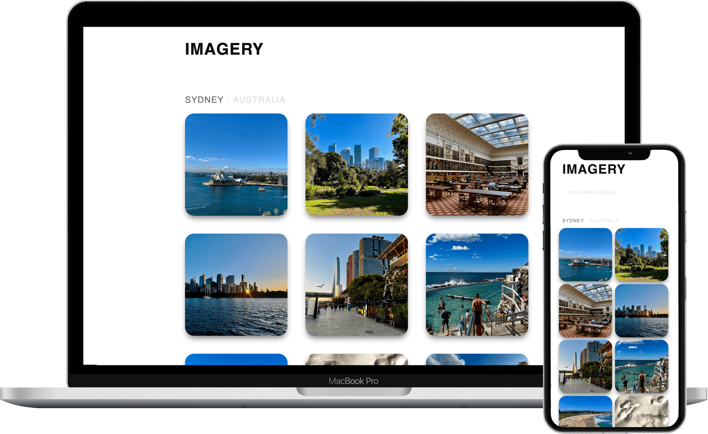

# 📸 Imagery
Generate your own online photograph gallery easily.

## Features
- Simple but beautiful UI.
- Auto-watermark your photos.
- Auto-generate thumbnails for better load speed.
- Sort photos by time, modify as you like, and keep it when you add new photos.
- Keep the order when you put new photos in.
- Support multi-level albums.
- Based on Jekyll and GitHub Pages.

## Demo
Here is a live demo: [romanboegli.ch/imagery](https://romanboegli.ch/imagery/)

## Template & Manual
See [soyaine/horcrux](https://github.com/soyaine/horcrux).

## License
MIT
